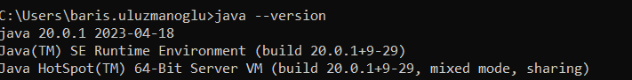
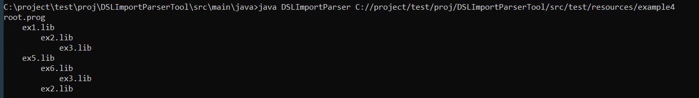

# Imports in Domain Specific Language(DSL)

- [Description](#description)
- [How to run this tools](#run-tool)


## Description
This tool takes as input a path to a root program, then parse the program and display the structure of the imports, for example, in the following format:

    root.prog
        library1.lib
        library2.lib
            library3.lib 


## How to run this tools

* Download the project from Github
* You should have java11 or above version in your local pc otherwise you can download from this link: https://www.oracle.com/java/technologies/javase/jdk11-archive-downloads.html
* open the git bash or command prompt
* check java version like this:
  * 
    ```bash
    java --version 
    ```
    [](docs/javaVersion.png)
* Navigate to "DSLImportParser.java" file location from command prompt or git bash
  * copy-paste and run first command from below section for build java files.
  * copy-paste and run second command. it should correct directory and exist root.prog file.
  * You can give sample directory from resource folder in test
  ```bash
  javac DSLImportParser.java
  java DSLImportParser src/test/resources/example3
  ```
  * Expected result shows below:
  * [](docs/expectedResult.png)
* Also, if you have any IDE you can also run/modify this tools. IntelliJ, Visual studio code, Eclipse or Netbeans

